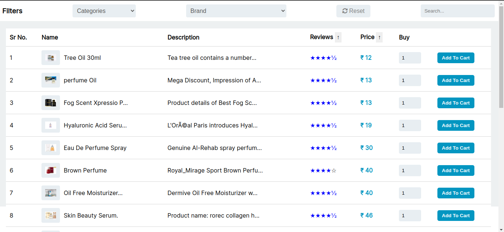

<h3 align="center">Infinite Scrolling</h3>

<br />

<h2 align="center">🖥️ Tech Stack</h2>


<h4 align="center">Frontend:</h4>

<p align="center">
 
    
    
 
  
  
   

</p>


<h4 align="center">Backend:</h4>

<p align="center">
  
  
  
  
</p>


<h4 align="center">Deployed On:</h4>

<p align="center">
  
    
</p>


<h3 align="center"><a href="https://orion-express-assignment.vercel.app/"><strong>Want to see live preview »</strong></a></h3>

<p align="center">
  <br />&#10023;
  <a href="https://orion-express-assignment.vercel.app/">View Demo</a> &#10023;
  <a href="https://github.com/Saurabhsanjay/orion--express-assignment/issues">Report Bug</a> &#10023;
  <a href="#Getting-Started">Getting Started</a> &#10023; 
  <a href="#Install">Installing</a> &#10023;
  <a href="#Contact">Author</a> &#10023;
</p>


## Glimpse of Infinite Scrolling 🙈 :


<table>
  <tr>
    <td></td>
    
  </tr>

 
</table>

<br />


## Getting Started

This project was built using HTML,CSS,TypeScript React, Rest API, Node JS, Express and MongoDB . It is an Infinite scrolling  application with search and filters for running on your local environment you should follow these guidelines.


### Prerequisites

- NPM
- Node JS
- MongoDB

### Setup


The project repository can be found in [GitHub link](https://github.com/Saurabhsanjay/orion--express-assignment) or just clone the project using this command.


```
Using HTTPS

# git clone https://github.com/Saurabhsanjay/orion--express-assignment.git
```

+ Open terminal on your workspace with

```
cd /home/workspace/orion-express-assignment
```


## Install

Install NPM

Check that you have node and npm installed

To check if you have Node.js installed, run this command in your terminal:


```
node -v
```

To confirm that you have npm installed you can run this command in your terminal:


```
npm -v
```

To confirm that you have MongoDB installed you can run this command in your terminal:


```
mongo -v
```


To install all the dependences of the project, run the following command:


```
cd client

npm install

cd ../

cd server

npm install
```


To run the application got to the client folder and run the following command:

```
npm start
```

### Environment Variables

To run this project, you will need to add the following environment variables to your .env file in server folder

`PORT`

`MONGO_URI`


### Tools used on this project

- Visual Studio Code
- Vite template
- MongoDB compass

<br />


## Contact

If you want to contact me, you can reach me through below handles.

[](https://www.linkedin.com/in/saurabh-ubale-035a18234/)
[](https://github.com/Saurabhsanjay)

© 2022 Saurabh_Ubale


## Show your support

Give a ⭐️ if you like this project!


